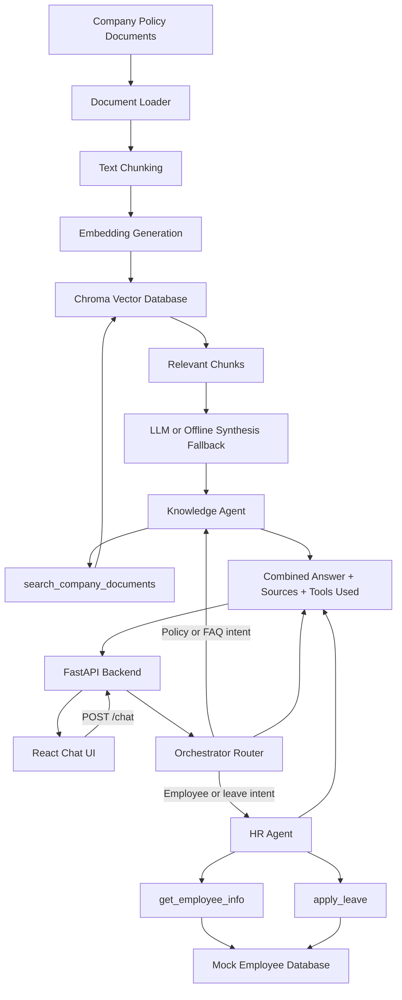

# EmployeeMate - RAG + Agentic Employee Assistant

EmployeeMate is a full-stack AI assistant for employee policy questions and basic HR actions. It combines a Retrieval-Augmented Generation pipeline with an agentic workflow that can choose between company document search, employee profile lookup, and leave application tools.

## Features

- Answers company policy questions from local company documents.
- Returns source document names for RAG answers.
- Refuses unsupported questions when information is not available in the documents.
- Fetches mock employee profile and leave balance data.
- Applies leave after checking available balance.
- Handles multi-tool questions such as asking for a policy and leave balance together.
- Maintains basic conversation history from the frontend to the backend.
- Shows assistant responses, sources, tools used, and routed agent in the React UI.

## Tech Stack

- Frontend: React, Vite, Tailwind CSS
- Backend: Python, FastAPI
- RAG framework: LangChain
- Vector database: ChromaDB
- Embeddings: Hugging Face `all-MiniLM-L6-v2`
- LLM: OpenAI Chat model when API credits are available
- Reranking: Sentence Transformers CrossEncoder
- Testing: Python `unittest`, FastAPI TestClient

## Architecture Diagram



## Project Structure

```text
app/
  agents/
    hr_agent.py
    knowledge_agent.py
    orchestrator.py
  config.py
  main.py
  mock_db.py
  rag.py
  tools.py
data/
  it_security_policy.txt
  leave_policy.txt
  travel_policy.txt
  wfh_policy.txt
frontend/
  src/
    components/
    services/
test_app.py
requirements.txt
```

## RAG Pipeline

The RAG pipeline is implemented in `app/rag.py`.

1. Loads `.txt` company policy files from the `data/` directory.
2. Derives metadata such as category and source file name.
3. Splits documents using `RecursiveCharacterTextSplitter`.
4. Generates local Hugging Face embeddings.
5. Stores embeddings in ChromaDB.
6. Retrieves relevant chunks using vector similarity search.
7. Applies CrossEncoder reranking for unfiltered searches.
8. Sends retrieved context to the LLM when OpenAI is available.
9. Falls back to offline synthesis when OpenAI is unavailable or quota is exhausted.
10. Returns an answer and source document names.

## Chunking Strategy

The project uses a configurable chunk size and overlap from `app/config.py`:

- `chunk_size = 500`
- `chunk_overlap = 50`

This keeps chunks small enough for focused retrieval while retaining nearby context across chunk boundaries.

## Retrieval Approach

- ChromaDB stores the embedded policy chunks.
- Metadata filtering is used for inferred categories such as WFH, leave, travel, and IT security.
- For category-specific policy questions, the app can use the complete matching source document so answers do not omit middle sections.
- For general questions, the retriever fetches top candidates and reranks them using a CrossEncoder.
- A relevance guard prevents unsupported answers for unrelated questions.

## Agent And Tools

The orchestrator routes requests to the correct agent:

- `KnowledgeAgent`: answers company policy and FAQ questions.
- `HRAgent`: handles employee profile and leave requests.
- `Orchestrator_MultiAgent`: combines both agents for hybrid questions.

Implemented tools:

- `search_company_documents(query, category=None)`
- `get_employee_info(employee_id)`
- `apply_leave(employee_id, start_date, end_date, reason)`

The leave application workflow checks employee ID, role permissions, date range, and available leave balance before applying leave.

## API Endpoints

- `GET /` - basic welcome endpoint
- `GET /health` - backend health and vector store status
- `GET /employees` - current mock employee records
- `POST /chat` - main assistant endpoint

Example request:

```json
{
  "prompt": "What is the leave policy and how many leaves does EMP001 have?",
  "emp_id": "EMP001",
  "actor_role": "EMPLOYEE",
  "history": []
}
```

Example response:

```json
{
  "answer": "Combined policy and employee response...",
  "sources": ["leave_policy.txt"],
  "tools_used": ["RAG_Policy_Search", "get_employee_info"],
  "agent_routed": "Orchestrator_MultiAgent",
  "updated_employees": []
}
```

## Setup

### Backend

```bash
python -m venv .venv
.venv\Scripts\activate
pip install -r requirements.txt
uvicorn app.main:app --host 0.0.0.0 --port 8000 --reload
```

Create a `.env` file in the project root:

```env
OPENAI_API_KEY=your_openai_api_key
OPENAI_MODEL=gpt-4o-mini
APP_ENV=development
DEBUG=true
```

If OpenAI credits are unavailable, the app still runs with local retrieval and offline synthesis fallback.

### Frontend

```bash
cd frontend
npm install
npm run dev
```

For local development, the frontend defaults to:

```text
http://localhost:8000
```

For deployment, set:

```env
VITE_API_BASE_URL=https://your-backend-domain.com
```

Then build:

```bash
npm run build
```

## Testing

Run backend tests:

```bash
python -m unittest -v
```

Run frontend production build:

```bash
cd frontend
npm run build
```

Current validation:

- Backend tests: 10 passing
- Frontend build: passing

## Sample Queries

1. RAG retrieval:
   - `What is the work from home policy?`

2. RAG retrieval:
   - `How many annual leaves are allowed?`

3. No-answer / hallucination prevention:
   - `Does the company provide pet insurance?`

4. Tool usage:
   - `How many leaves does EMP001 have?`

5. Multi-tool workflow:
   - `What is the leave policy and how many leaves does EMP001 have?`

6. Leave application:
   - `Apply leave for EMP001 from 20 September to 22 September because I am travelling.`

7. Conversational context:
   - `How many leaves will I have after applying?`

## Assumptions

- The company policy documents are trusted local files.
- Employee data is mocked in memory and resets when the server restarts.
- Employee IDs follow the `EMP001` style used in the mock database.
- OpenAI is optional at runtime because the app has an offline answer synthesis fallback.

## Limitations

- The mock database is not persistent.
- The offline fallback is less natural than a live LLM response.
- OpenAI responses require a valid API key with available credits.
- Date parsing for leave requests is basic and focused on the assessment scenarios.
- CORS is open for development and should be restricted before production deployment.

## Deployment Notes

1. Deploy the FastAPI backend to a Python hosting platform.
2. Set production environment variables for `OPENAI_API_KEY`, `OPENAI_MODEL`, `APP_ENV`, and `DEBUG`.
3. Restrict CORS in `app/main.py` to the deployed frontend domain.
4. Deploy the React app as a static site from `frontend/dist`.
5. Set `VITE_API_BASE_URL` to the deployed backend URL before building the frontend.

